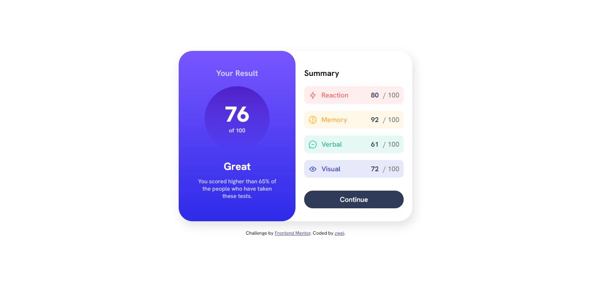

# Frontend Mentor - Results summary component solution

This is a solution to the [Results summary component challenge on Frontend Mentor](https://www.frontendmentor.io/challenges/results-summary-component-CE_K6s0maV). Frontend Mentor challenges help you improve your coding skills by building realistic projects.

## Table of contents

- [Overview](#overview)
  - [The challenge](#the-challenge)
  - [Screenshot](#screenshot)
  - [Links](#links)
- [My process](#my-process)
  - [Built with](#built-with)
- [Author](#author)

## Overview

Result Summary Component Challange by Frontend Mentor. Desktop version, made with HTML and CSS.

### The challenge

Users should be able to:

- View the optimal layout for the interface depending on their device's screen size
- See hover and focus states for all interactive elements on the page
- **Bonus**: Use the local JSON data to dynamically populate the content

### Screenshot

### Links

- Solution URL: [zwei9lake](https://www.frontendmentor.io/solutions/result-summary-component-challange-desktop-version-using-html-and-css-J17DmdoIyr)
- Live Site URL: [zwei9lake](https://zwei9lake.github.io/result-summary-component/)

### Built with

- Semantic HTML5 markup
- CSS custom properties
- Flexbox

## Author

- Frontend Mentor - [@zwei9lake](https://www.frontendmentor.io/profile/zwei9lake)
